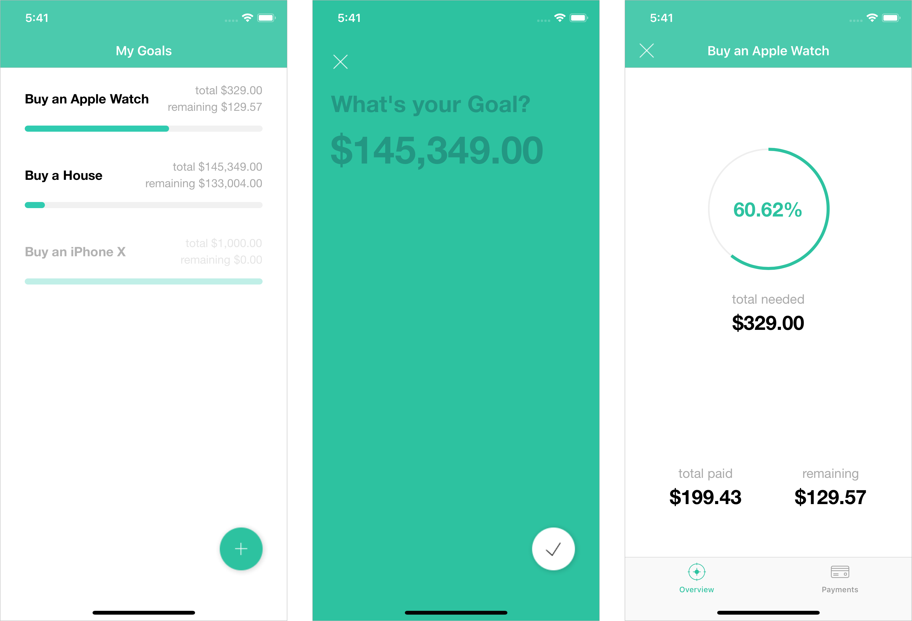

# Goals
Goals is what the name implies, it is a goal tracker where the user can add financial related goals and keep track of their achievements.

## Technologies used
- IGListKit
- Realm
- RxSwift

## Architecture
The app is developed using the MVVM architecture with reactive components for binding the ViewController and ViewModel.

